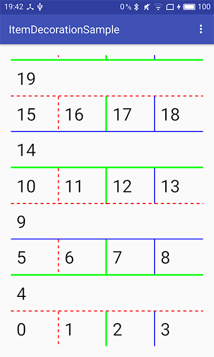
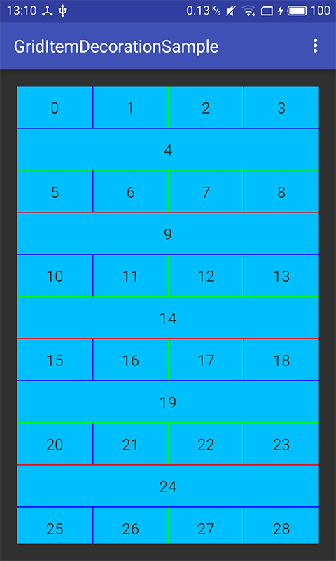
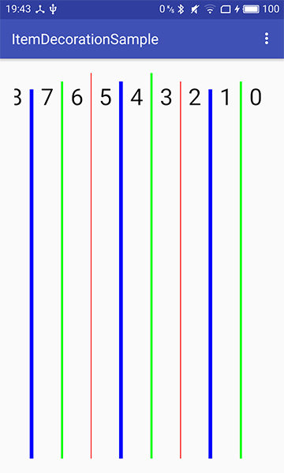
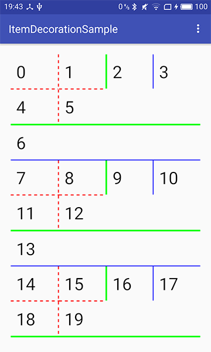

# ItemDecorations
## [English](https://github.com/dkzwm/ItemDecorations/blob/master/README.md) | 中文

<p>
ItemDecorations是RecyclerView的分隔线库，现阶段支持使用GridLayoutManager或LinearLayoutManager的布局管理器
<p/>

## 特性
 1.当使用GridLayoutManager时，支持跨列特性(SpanLookup)  
 2.支持横向和纵向布局  
 3.支持倒序(Reversed)
 4.支持分割线画在每个视图内部  

## 如何使用
 请参照示例Demo,使用很简单
 
## Gradle
```groovy
repositories {  
    ...
    maven { url 'https://jitpack.io' }  
}

dependencies {  
    compile 'com.github.dkzwm:ItemDecorations:v1.0.0'
}
``` 
## 预览图
<p>


<p/>
<p>


<p/>


  License
  -------

      Copyright 2017 dkzwm

      Licensed under the Apache License, Version 2.0 (the "License");
      you may not use this file except in compliance with the License.
      You may obtain a copy of the License at

         http://www.apache.org/licenses/LICENSE-2.0

      Unless required by applicable law or agreed to in writing, software
      distributed under the License is distributed on an "AS IS" BASIS,
      WITHOUT WARRANTIES OR CONDITIONS OF ANY KIND, either express or implied.
      See the License for the specific language governing permissions and
      limitations under the License.